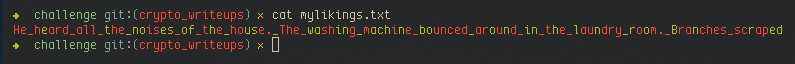

# Writeup for Bacon Challenge

The color code corresponds to the a's and b's in the [Bacon's Cipher]("https://en.wikipedia.org/wiki/Bacon's_cipher")

Since we know, the bacon code has each letter mapped to 5 letter string of a's and b's.

Here is the screenshot of `myliking.txt` printed on the terminal, displaying the text colored.

+ Split the string in lenght of 5
+ Mark one color to a's and another to b's
+ Refer the Bacon Cipher table, matching the obtained sequence to the letter it maps to
+ Join all the letters for the flag
